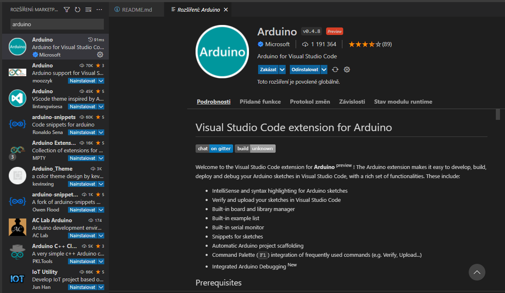

# Arduino-VScode-Tutorial
 Jak nastavit Visual Studio Code pro Arduino, jednotuchý návod na vytvoření nového projeku Arduino

 # 1. Příprava Visual Studio Code
 Instalace Arduino Extension - CTRL+SHIFT+x spustí seznam rozšíření kde je nutné nají ARDUINO
 
