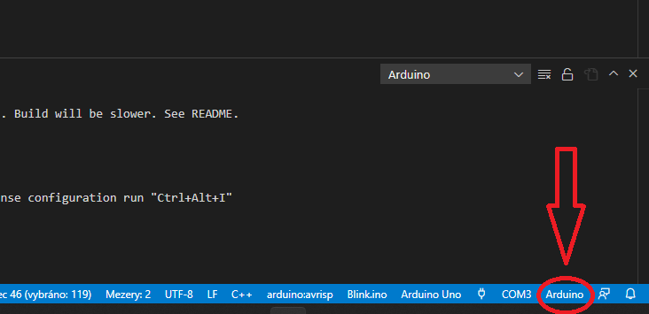

# Arduino-VScode-Tutorial
 Jak nastavit Visual Studio Code pro Arduino, jednoduchý návod na vytvoření nového projeku Arduino,
 který obsahuje soustu pravopisných a jiných chyb. 

 # 1. Příprava Visual Studio Code
 Instalace Arduino Extension - CTRL+SHIFT+x spustí seznam rozšíření kde je nutné najít ARDUINO

 

 A samozřejmě nainstalovat. Tuto instalaci provedu pouze jednou při instalaci nového VS Code.
 
 # pak se ještě musí udělat několik nastavení
 bla bla bla bla

 # Založnení nového projeku Arduino
 Do nového projeku zkopírovat z tohoto projeku soubory arduino.json a c_cpp_properties.json z adresáře .vscode
 Vlevo dole pak zkontrolovat COM port a jazyk kde by mělo být Arduino.

  

A to je asi tak vše.
