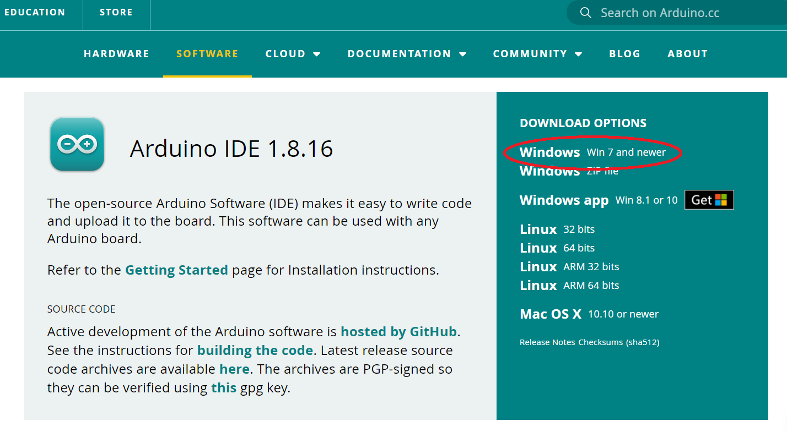
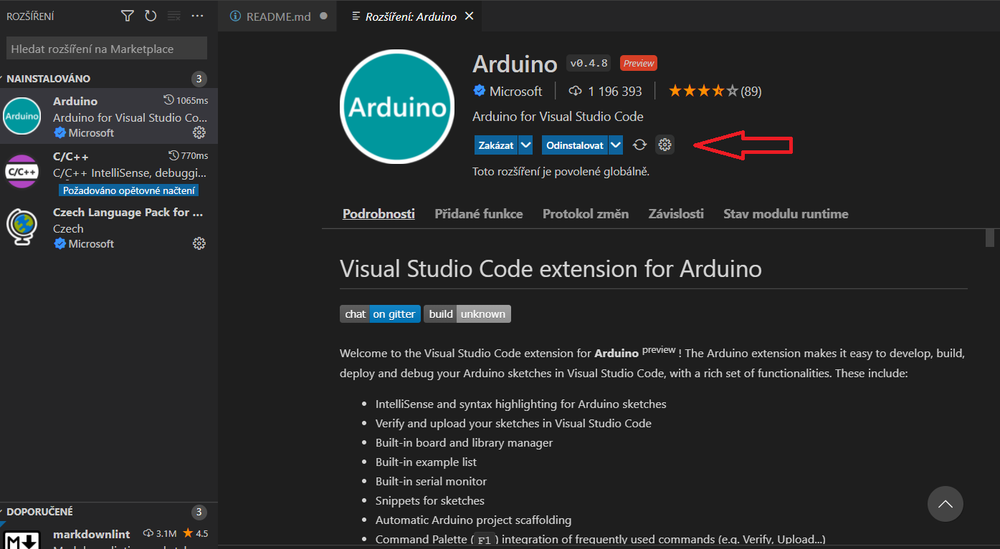
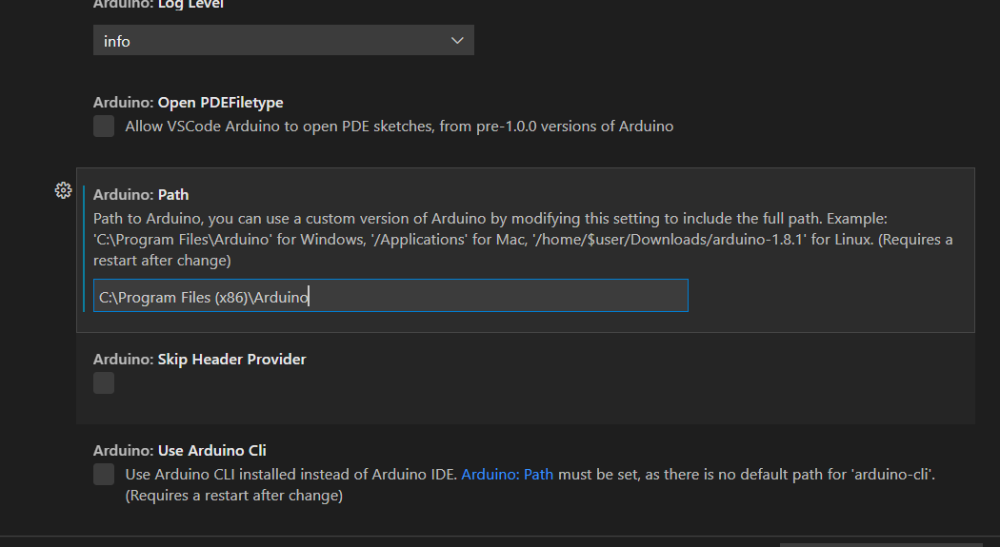

# Arduino-VScode-Tutorial
 Jak nastavit Visual Studio Code pro Arduino, jednoduchý návod na vytvoření nového projeku Arduino,
 který obsahuje soustu pravopisných a jiných chyb. 

 # 1. Příprava Visual Studio Code
 Instalace Arduino Extension - CTRL+SHIFT+x spustí seznam rozšíření kde je nutné najít ARDUINO

 

 A samozřejmě nainstalovat. Tuto instalaci provedu pouze jednou při instalaci nového VS Code.
 
 # Instalace Arduino IDE a nastavení Arduino Extension
 Nyní je nunto nainstalovat Arduino IDE (mám to vyzkoušené na verzi 1.8.x) Ze stránek https://www.arduino.cc/en/software stáhnout verzi Windows. (Nestahovat verzi Windows APP)

 

 A samozřejmě zase nainstalovat. Po instalaci znovu vyhledat rozřšíření Arduino a nastvit. Je tam takové malé ozubené kolečko. Kde vyberu "Nastavení rozšíření"

 

 V rozšíření je nutno janít položku "Arduino:Path" a zapsat tam hodnotu cesty k právě nainstalovanému Arduino IDE (standartně C:\Program Files (x86)\Arduino) Pak už jen nastavení uzavřít a restartovat VisualStudio Code.

 

 # Založnení nového projeku Arduino
 Do nového projeku zkopírovat z tohoto projeku soubory arduino.json a c_cpp_properties.json z adresáře .vscode (nebo celý adresář .vscode)
 Vlevo dole pak zkontrolovat COM port a jazyk kde by mělo být Arduino.

  

A to je asi tak vše.
